### Практично-лабораторне заняття №4

## Реалізація нової сутності, створення CRUD-операцій та відповідного RESTful API

**Мета**

Закріпити навички створення повноцінної серверної логіки для роботи з
новою сутністю за допомогою TypeORM, Express та TypeDI. Ознайомитися з
процедурою створення міграцій, перевірки змін у структурі бази даних та
тестування REST API через Postman.

Генеруємо міграцію

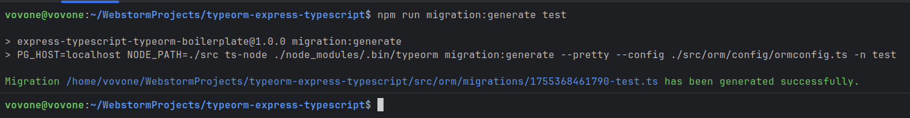

Був створений файл:

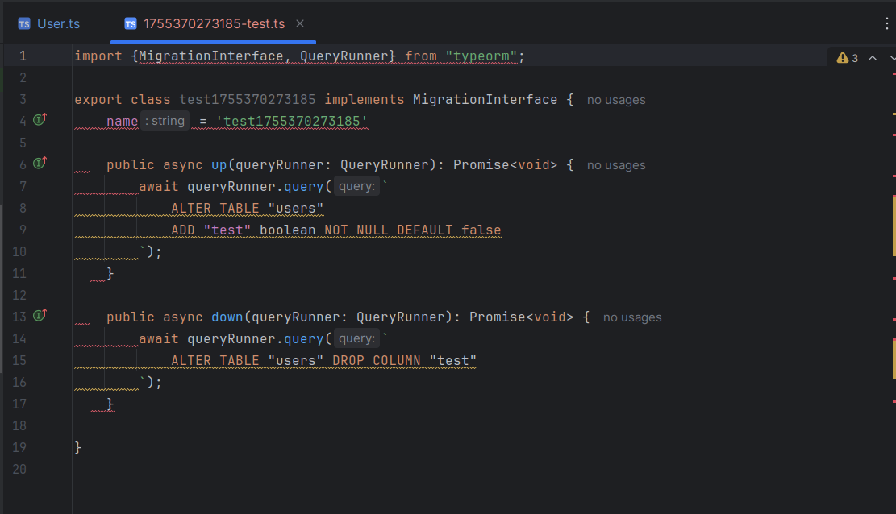

Запускаємо міграцію:

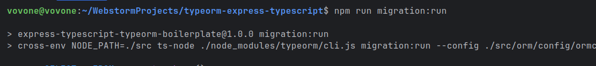

У таблиці БД з\'явилась нова таблиця **test**

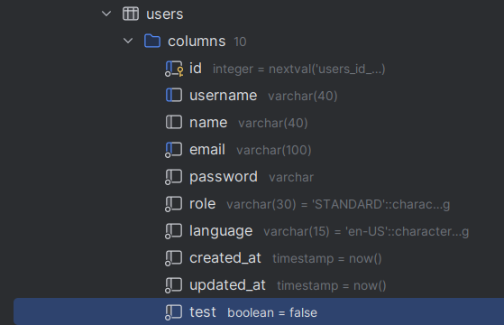

Створюємо файл **list.ts** в каталозі
**/src/controllers/posts/lists.ts**

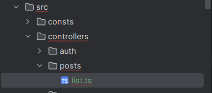

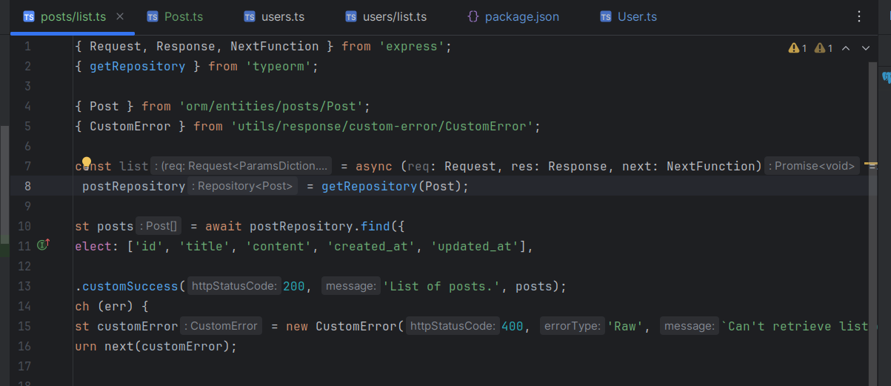

#### 1. Створити нову сутність Post:

-   Визначити поля:

    -   id: UUID, первинний ключ

    -   title: рядок, обов'язковий

    -   content: текст, необов'язковий

    -   createdAt: дата створення, автоматично заповнюється

    -   updatedAt: дата оновлення, автоматично оновлюється

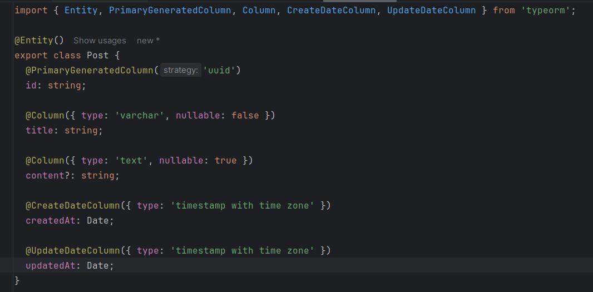

#### 2. Створити та застосувати міграцію:

-   Згенерувати міграцію для нової сутності.

> 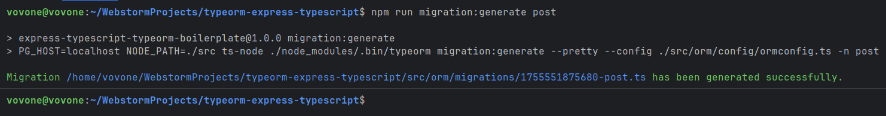
>
> 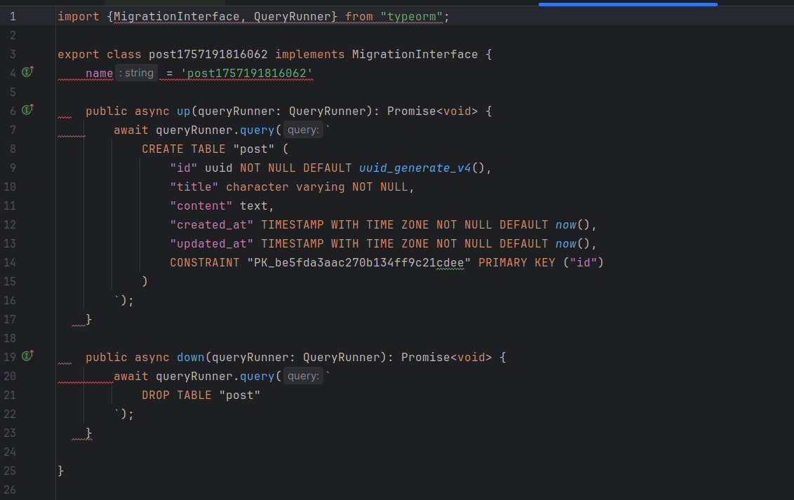

-   Запустити міграцію через CLI.

> 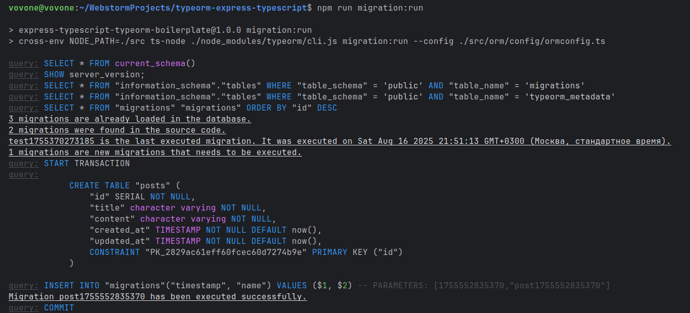

-   Перевірити у базі даних (наприклад, через pgAdmin або консоль), що
    структура таблиці відповідає очікуваній.

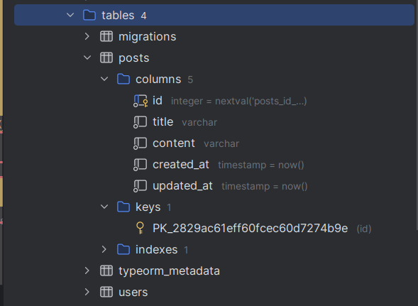

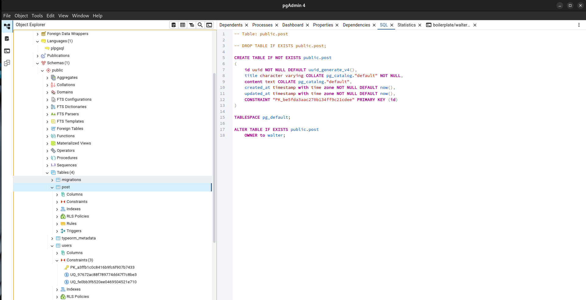

#### 3. Реалізувати RESTful API для CRUD-операцій:

-   **C**reate: створення нового поста

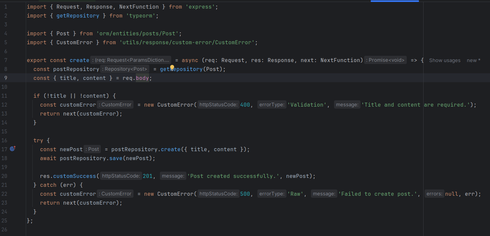

-   **R**ead:

    -   отримання всіх постів

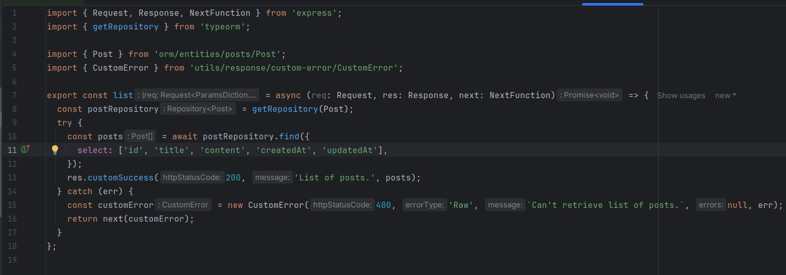

-   отримання одного поста за ID

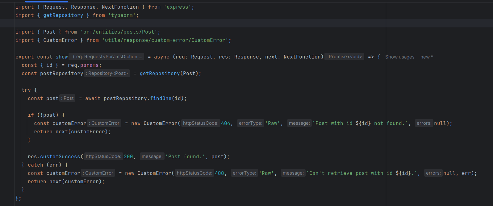

-   **U**pdate: оновлення поста за ID

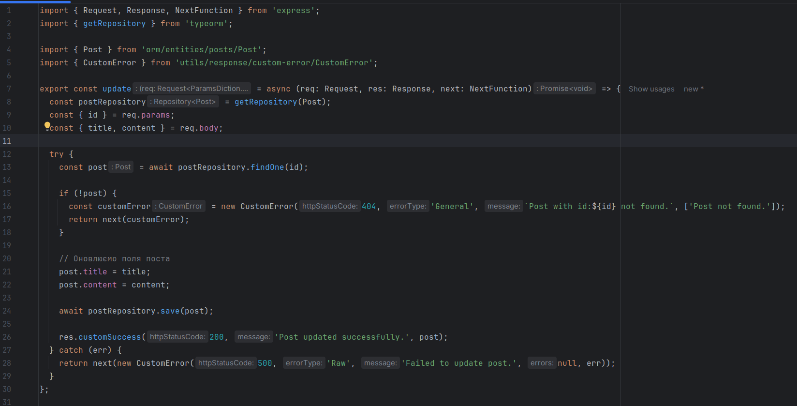

-   **D**elete: видалення поста за ID

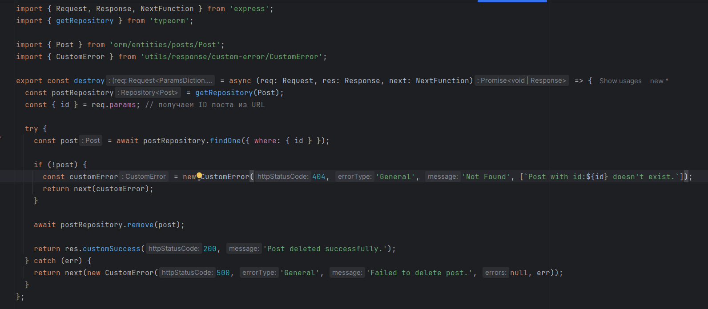

-   Використовувати контролер, DTO, роутер та сервіс за прикладом
    реалізації для User.

Index.ts

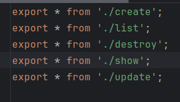{

Index.ts

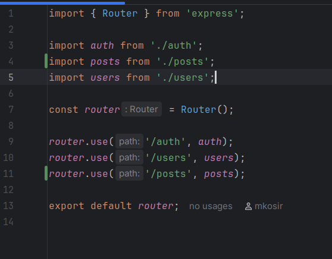

Routes/v1/posts.ts

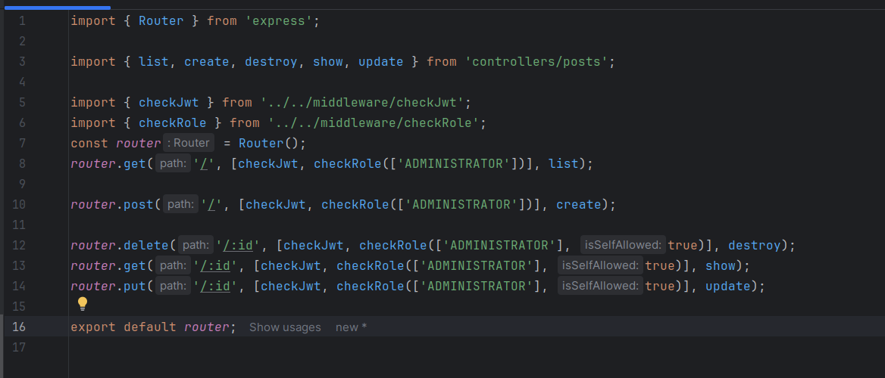{

#### **5. Протестувати REST API через Postman:**

-   Створити окрему колекцію для запитів.

-   Додати приклади:

    -   створення поста,

> 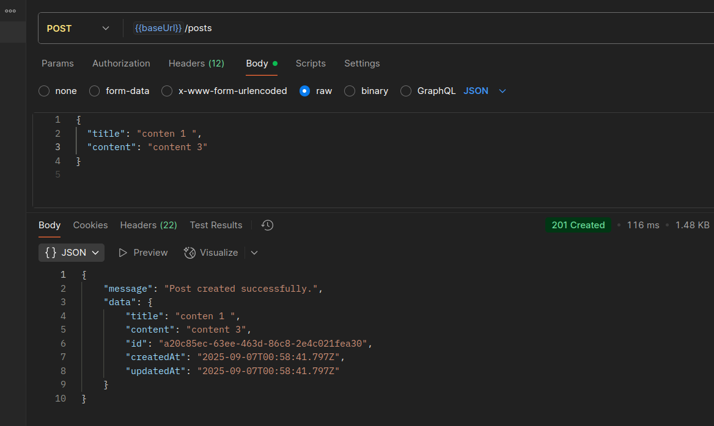

-   отримання всіх постів,

> 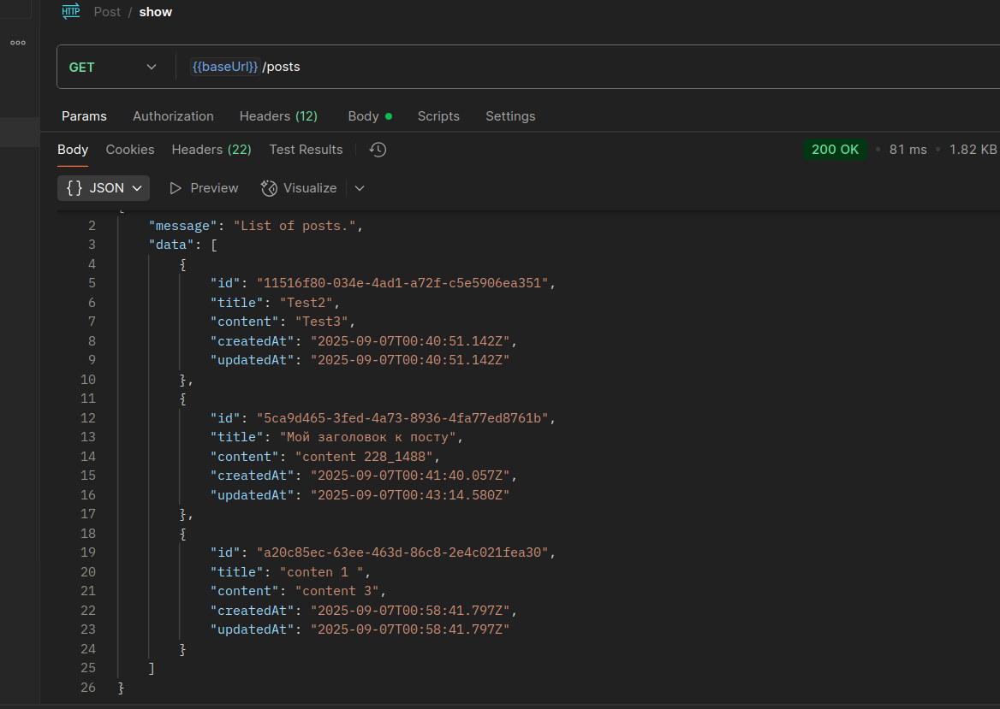

-   отримання поста за ID,

> 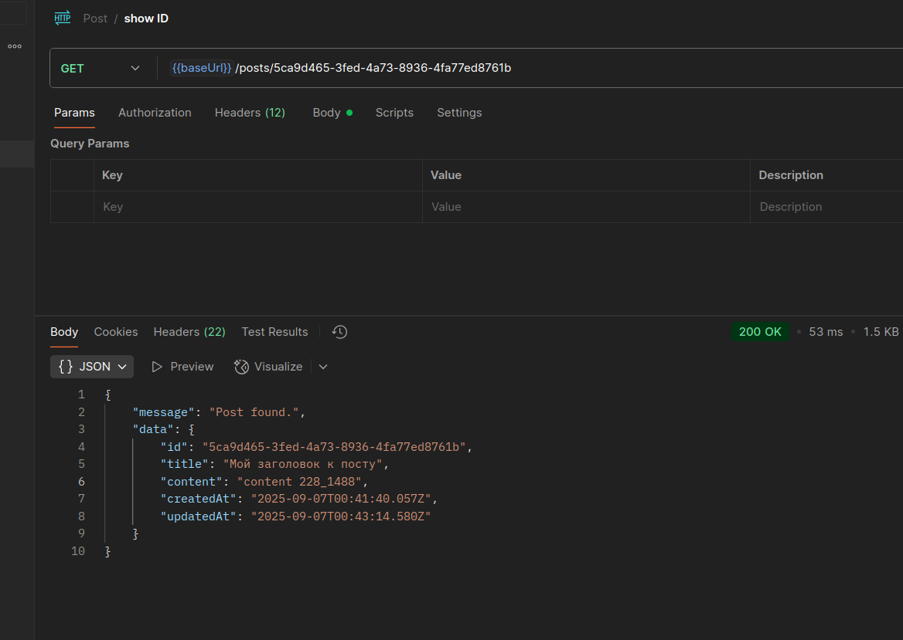

-   оновлення поста,

> 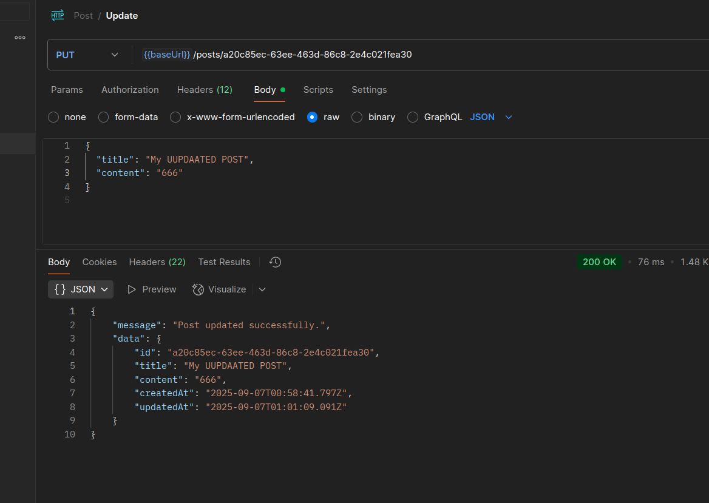
>
> 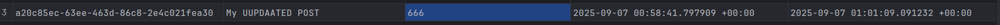{

-   видалення поста,

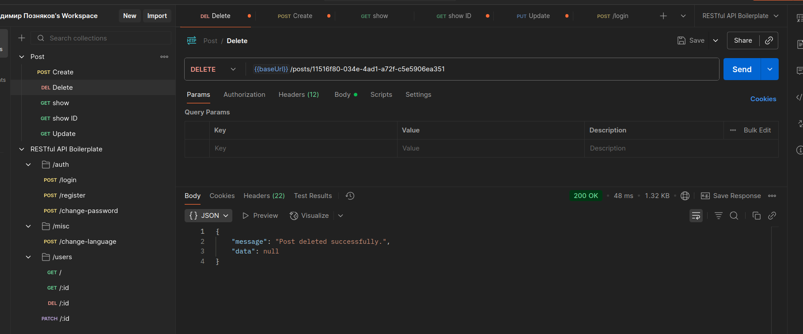

Висновок:

Закріпив навички створення повноцінної серверної логіки для роботи з
новою сутністю за допомогою TypeORM, Express та TypeDI. Ознайомився з
процедурою створення міграцій, перевірки змін у структурі бази даних та
тестування REST API через Postman.

p
